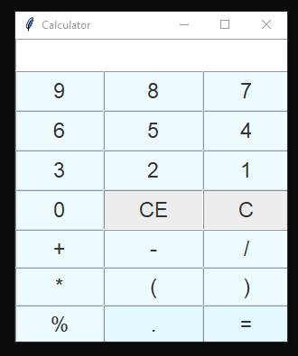

# Simple Tkinter Calculator

**Can do**:
- addition (Finding the Sum; '+') 
- subtraction (Finding the difference; '-') 
- multiplication (Finding the product; '×' ) 
- division (Finding the quotient; '÷')
- modulo (Finding the remainder of a divided number, '%')
- working with brackets and decimal numbers 
- bound keyboard keys to functions for button press
- clearing the input (C and CE)

**Issues**:
- with negative numbers - can output a negative number but for example if the negative number in the calculation in the calc is first (-2+5) it crashes
- if empty after/before dot (no number) - works but does not add 0 after/before dot

**Using**:
- Python version: 3.7.9
- Tkinter version: 8.6
